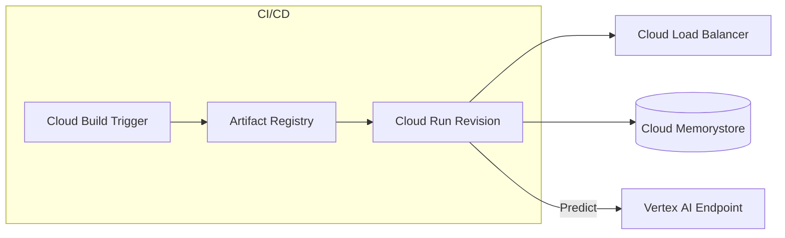

# Twincare \U0001F491

*A privacy‑first virtual healthcare assistant that performs symptom triage, appointment booking, and insurance guidance — all powered by on‑prem LLMs and FastAPI.*

---

## ✨ Key Features

| Feature                     | Description                                                                                                                                                     |
| --------------------------- | --------------------------------------------------------------------------------------------------------------------------------------------------------------- |
| **Multi‑agent routing**     | MCPCore intelligently routes each user message to specialised agents (medical triage, booking, insurance) using semantic similarity + zero‑shot classification. |
| **On‑device LLM inference** | Uses a local **Llama.cpp** Med‑Alpaca model for HIPAA‑friendly, low‑latency language generation.                                                                |
| **Context persistence**     | Conversation state is cached in Redis with TTL‑controlled keys so agents retain short‑term memory without long‑term PII retention.                              |
| **FastAPI microservice**    | Thin HTTP layer exposes a clean JSON API (REST) with automatic OpenAPI docs.                                                                                    |
| **Plug‑and‑play agents**    |  Agents share a common `BaseChatAgent` interface, making it trivial to add new verticals (nutrition, mental health, etc.).                                      |
| **Observability hooks**     | Core metrics (request latency, error count, token usage) emitted via `/stats` endpoint and ready for Prometheus / Grafana.                                      |

---

## 🏗️ System Architecture

```mermaid
graph TD
    subgraph Client
        A[Web / Mobile App]
    end

    A -->|HTTPS JSON| B[FastAPI Router]
    B --> C[MCPCore \n(message orchestrator)]
    C -->|conversation id| D[Redis]
    C --> E[MedicalChatAgent]
    C --> F[BookingAgent]
    C --> G[InsuranceAgent]

    %% LLM calls
    subgraph On‑Device LLMs
        E --> H[Llama.cpp \nMed‑Alpaca‑2‑7B]
        E --> I[HF Zero‑Shot \nBART‑MNLI]
    end

    %% External integrations
    F --> J[Calendar API]
    G --> K[Insurance API]
```

*High‑level message flow:*

1. **Client** sends `POST /route`.
2. **FastAPI Router** validates payload (`AgentRequest`).
3. **MCPCore** checks Redis for context ➜ chooses best agent.
4. Selected **Agent** generates a response (may call LLM / external APIs).
5. Response is returned as `AgentResponse` → client UI.

### MCPCore (Message Control Plane)

MCPCore is the **central routing brain** of TwinCare. It performs three critical tasks before delegating work to downstream agents:

1. **Intent inference & scoring**
   Utilises a Sentence‑Transformer (`all‑MiniLM‑L6`) and a zero‑shot NLI classifier to compute a confidence score for every registered agent. The highest‑scoring agent wins; ties are broken by a deterministic round‑robin.
2. **Context stitching**
   Pulls the user’s short‑term context from Redis, merges it with the current prompt, and injects a conversation header that preserves PHI boundaries.
3. **Safety gatekeeping**
   Runs each outgoing prompt through a lightweight Med‑ToxiScore model to block disallowed content before the LLM fires.

Because MCPCore is stateless **by design**, you can scale it horizontally behind any load balancer without sticky sessions.

---

## 📁 Repository Layout

```text
app/
├── agents/            # MedicalChatAgent, BookingAgent, ...
├── context/           # Redis‑backed ContextManager
├── core/              # MCPCore orchestrator
├── config/            # settings.py, redis_config.py
├── protocol/          # Pydantic schemas + API router
├── utils/             # (e.g., encryption stubs)
├── main.py            # FastAPI startup
tests/                 # PyTest suites
requirements.txt       # Python deps
Dockerfile (coming soon)
```

---

## 🚀 Getting Started

### Prerequisites

* Python 3.9+
* Redis 5+
* GCC / clang (for llama.cpp build)
* (Optional) GPU w/ CUDA 11+ for HF pipelines

### 1 · Clone & create virtualenv

```bash
git clone https://github.com/hubHarshit/twincare.git
cd twincare-backend
python -m venv .venv && source .venv/bin/activate
pip install -r requirements.txt
```

### 2 · Download the LLM weights

```bash
# example — adjust path and model as needed
wget https://huggingface.co/medalpaca/MedAlpaca-2-7B-GGUF/resolve/main/med-alpaca-2-7b-chat.Q4_K_M.gguf \
     -O models/Med-Alpaca-2-7b-chat.Q4_K_M.gguf
```

### 3 · Configure environment

Create a **.env** file (or export vars) — values below are defaults.

```env
# .env
REDIS_HOST=localhost
REDIS_PORT=6379
REDIS_DB=0
REDIS_TTL=86400          # seconds
MODEL_PATH=models/Med-Alpaca-2-7b-chat.Q4_K_M.gguf
```

### 4 · Run the API

```bash
uvicorn app.main:app --reload --host 0.0.0.0 --port 8000
```

Visit **[http://localhost:8000/docs](http://localhost:8000/docs)** for interactive Swagger UI.

---

## 🗺️ API Reference

### `POST /route`

| Field        | Type   | Description                |
| ------------ | ------ | -------------------------- |
| `user_id`    | string | Unique ID for user session |
| `input_text` | string | User’s message             |
| `context`    | object | (Optional) extra metadata  |

<details>
<summary>Sample cURL</summary>

```bash
curl -X POST http://localhost:8000/route \
     -H "Content-Type: application/json" \
     -d '{
           "user_id": "abc123",
           "input_text": "I have a sore throat and fever",
           "context": {}
         }'
```

</details>

### `GET /stats`

Returns JSON with request count, average latency, error tally, etc.

### `GET /agent/{agent_id}/status`

Health information for a particular agent.

---

## 🧪 Running Tests

```bash
pytest -q
```

---

## 📦 Docker (optional)

> **Coming soon** — multi‑stage build with llama.cpp + poetry.

```Dockerfile
# skeleton
FROM python:3.9-slim AS base
WORKDIR /app
COPY requirements.txt .
RUN pip install --no-cache-dir -r requirements.txt
COPY app/ app/
CMD ["uvicorn", "app.main:app", "--host", "0.0.0.0", "--port", "8000"]
```

---

## ⚙️ Deployment

TwinCare can run everywhere—from a single GPU laptop to a fully managed, HIPAA‑compliant stack on **Google Cloud Platform**. Below are the most common footprints.

### Local (Docker Compose)

```bash
docker compose -f ops/docker/docker-compose.local.yml up --build -d
```

* Spins up **API** + **Redis** containers.
* Binds the `models/` host folder so you can iterate on quantised `*.gguf` weights without rebuilding the image.

### Kubernetes on GKE

* Helm chart lives in `helm/twincare`.
* Creates:

  * **Deployment** for FastAPI pods (`replicas=3`, HPA on CPU + queue length)
  * **RedisCluster** via redis-operator
  * **PVC** (ReadWriteOnce) to store llama.cpp weights
  * **ConfigMap** with environment settings
* Add a GPU node pool (e.g. n1‑standard‑4‑T4) and switch the inference backend to `llama.cpp --gpu-layers=35` for 10× throughput.

### Cloud Run + Vertex AI (serverless‑GPU)

1. **Build & Push**: Cloud Build executes `cloudbuild.yaml` → pushes image to **Artifact Registry**.
2. **Serve API**: Deploy the revision to **Cloud Run** (`--cpu=2 --memory=4Gi --max-instances=40`).
3. **LLM Offload**: Flip the env var `USE_VERTEX_AI=1` and route all `MedicalChatAgent` completions to a **Vertex AI** Text Generation Inference endpoint (Gemma‑7B, PaLM‑2, or custom model).
4. **Async Tasks**: Long‑running EHR or pVerify calls are dispatched to **Cloud Tasks**.
5. **Observability**: Cloud Run automatically exports logs to Cloud Logging; metrics/traces are picked up by Cloud Monitoring with an opinionated dashboard JSON under `ops/monitoring`.



### Secrets & Compliance

* **Secret Manager** holds API tokens; the Helm chart auto‑mounts them as env vars.
* Enable **VPC‑SC** + **Private Service Connect** for Vertex AI if PHI data ever leaves the pod.
* For auditability, MCPCore emits a structured JSON audit log for every decision edge—ship it to **BigQuery** via Log Router.

---

## 🤝 Contributing

1. Fork the repo & create your branch: `git checkout -b feature/awesome`
2. Run `make precommit` (black, isort, flake8, mypy)
3. Submit a PR — describe *why* & *how*.

All discussions happen in **GitHub Issues** ➜ feel free to open feature ideas or bug reports.

---

## 📄 License

MIT © Harshit Pant

---

## 🙏 Acknowledgements

* [Med‑Alpaca](https://github.com/medalpaca) and [Llama‑cpp](https://github.com/ggerganov/llama.cpp)
* [FastAPI](https://fastapi.tiangolo.com/) community
* [SentenceTransformers](https://www.sbert.net/)
* Inspiration from Stanford HAI “AI for Healthcare” labs

> *Stay healthy, stay private — TwinCare has your back.*
